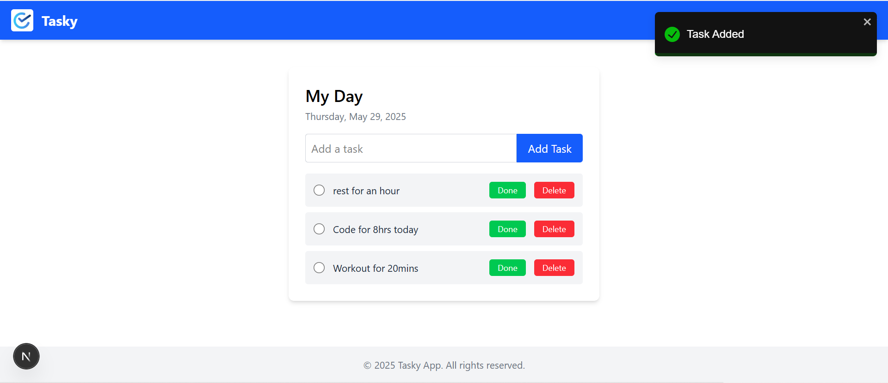

<div align="center">


[](https://twitter.com/intent/follow?screen_name=paschalugoh)

<br />
<br />

<h2 align="center">📋 Task Manager App</h2>

A modern, responsive, audio-enhanced task manager built with Next.js, MongoDB, and Tailwind CSS.  
Easily manage your daily tasks, track history, and stay productive with sound feedback.

</div>

---

### Demo Screenshot



---

### Features

- Add, complete, and delete tasks
- Audio sounds on task actions (clap, oops, delete)
- Tasks grouped and sorted by date
- UI feedback for "Completed" vs "Undone" (based on due date)
- RESTful API with Mongoose & MongoDB
- Built with Next.js App Router

---

### Tech Stack


- **Frontend:** Tailwind CSS, React
- **Database:** MongoDB
- **Notifications:** React Toastify

---

### Prerequisites

Before you begin, ensure you have met the following requirements:

- [Git](https://git-scm.com/downloads "Download Git") must be installed on your operating system.

### Run Locally

To run **Tasky** locally, run this command on your git bash:

Linux and macOS:

```bash
sudo git clone https://github.com/UgohP/tasky.git
```

Windows:

```bash
git clone https://github.com/UgohP/tasky.git
```

### Contact

If you want to contact with me you can reach me at
<br/>

- [X(formally Twitter)](https://x.com/pasky_u)

- [LinkedIn](https://linkedin.com/in/ugohpaschal).
